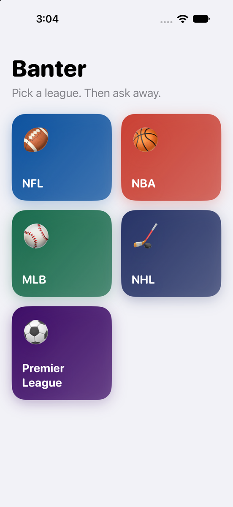
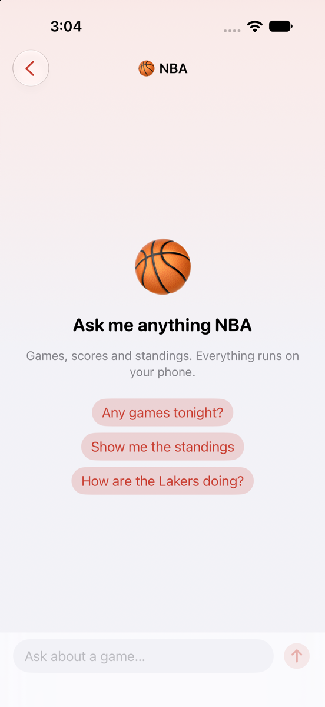
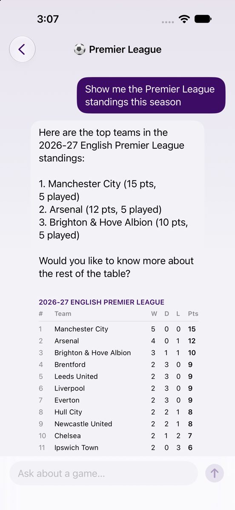
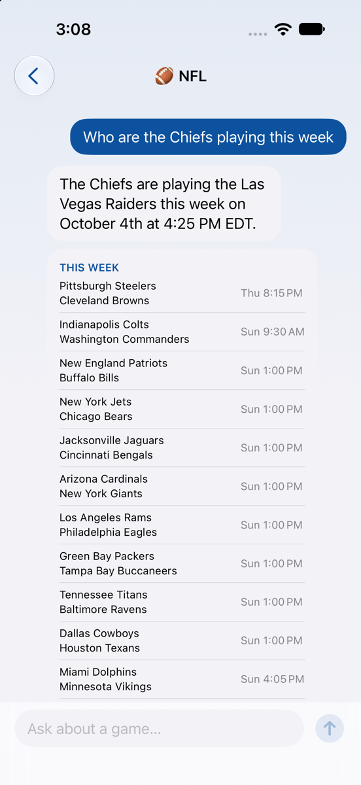

# Banter iOS

A sports chat that runs entirely on the phone. You pick a league, then ask about this week's
games, scores and standings. The answers come from Apple's on-device language model, which
looks facts up through tools instead of guessing. Data is downloaded from ESPN's public
endpoints and kept in a local SwiftData database so most questions never touch the network.

Requires iOS 27 and a device with Apple Intelligence.

## Screenshots

| Pick a league | Empty chat | Standings reply | Schedule reply |
|---|---|---|---|
|  |  |  |  |

Taken on an iPhone 18 Pro simulator running iOS 27. The replies and tables are real: the
on-device model called the standings and schedule tools against live ESPN data.

## The shape of it

```
┌──────────────────────────── ui ────────────────────────────┐
│  LandingView ─┬─ LeagueSelectionView                        │
│               └─ ChatView ── MessageBubbleView ── tables    │
└──────────────────────────────┬──────────────────────────────┘
                               │ ChatViewModel (@Observable)
┌──────────────────────────────┴──────────────────────────────┐
│  ChatAgent ── LanguageModelSession ── tools                 │
│  Guardrail    (one yes/no question before the agent runs)   │
└──────────────────────────────┬──────────────────────────────┘
                               │ LeagueStore: "database or network?"
┌──────────────────────────────┴──────────────────────────────┐
│  SwiftData rows        SportsApiService ── ESPN             │
└─────────────────────────────────────────────────────────────┘
```

```
Banter-iOS/
├── BanterApp.swift            builds the ModelContainer, LeagueStore and ChatViewModel
├── ChatAgent.swift            one model session per league, with tools
├── ChatViewModel.swift        selected league, messages, send()
├── Guardrail.swift            sports-only classifier
├── api/
│   ├── ApiService.swift       generic GET + decode, ApiError, NetworkMonitor
│   └── SportsApiService.swift ESPN endpoints and the two fetches
├── data/
│   ├── CachedModels.swift     the SwiftData rows
│   └── LeagueStore.swift      cache-first reads, sync, offline fallback
├── models/
│   ├── League.swift           the leagues, their names, emoji and suggestions
│   ├── Game.swift             ESPN game shape → Matchup
│   ├── Standing.swift         ESPN standings shape → TeamStanding
│   ├── Schedule.swift         Scoreboard envelope
│   └── ChatMessage.swift      a bubble, its role and optional table
├── tools/
│   ├── SportsScheduleTool.swift
│   ├── SportsStandingsTool.swift
│   └── DateTool.swift
└── ui/                        SwiftUI views, one per file
```

## One question, end to end

1. `ChatView` hands the text to `ChatViewModel.send`.
2. `Guardrail` asks the model a single structured question: is this about sports? If not, a
   fixed reply goes back and the agent never sees the message.
3. `ChatAgent.respond` sends the message to the session. The model decides whether to call a
   tool. If it does, the framework runs the tool and feeds the result back to the model.
4. Tools ask `LeagueStore`, never the API. The store returns SwiftData rows if they are under
   15 minutes old, otherwise downloads a fresh copy and replaces them. If the download fails but
   old rows exist, the old rows are returned.
5. The agent reads the session transcript to see which tools were called and reports them.
6. The view model attaches the matching rows to the message. `MessageBubbleView` draws them as
   a table under the text.

## Patterns

**Three shapes per kind of data.** Every fact goes through the same three types:
ESPN's shape, decoded as-is; the app's shape, flat and in our own words; and the SwiftData
row. `Game` → `Matchup` → `CachedGame`. `StandingsResponse` → `TeamStanding` → `CachedStanding`.
Keeping them apart means an ESPN change touches one file, and the UI never sees JSON quirks.

**Agent = session + instructions + tools.** A character or specialist is a `LanguageModelSession`
with instructions as its system prompt and tools it may call. The tools are small structs
conforming to `Tool`, with `@Generable` arguments so the model knows their shape. Adding a
capability means adding a tool, not editing prompt logic.

**Cache first, in one place.** `LeagueStore` is the only type that knows both SwiftData and
the API. Everything else asks it for `standings(for:)` or `matchups(for:)` and does not care
where the rows came from.

**Guardrail by structured generation.** Instead of parsing "yes" out of prose, the classifier
asks for a `@Generable` struct with one `Bool`. The answer is typed, so the check is a plain
`guard`.

**Tables from the transcript.** The model writes prose; the app draws data. Rather than asking
the model to format a table, the view model checks which tool ran and shows the same rows the
tool saw. Small models are bad at tables and good at summaries, so each does its part.

**A fixed context window, handled in one place.** The on-device model has a fixed window (4,096
tokens on iOS 26, 8,192 reported on the iOS 27 simulator) shared by the instructions, every
prompt, every reply and every tool result. A long chat overflows it, and once it has, every later
turn fails too. `ChatAgent` catches the overflow, rebuilds the session from a condensed transcript
(just the instructions) and resends the message once. Note the error was renamed in iOS 27:
`GenerationError.exceededContextWindowSize` is deprecated and `LanguageModelError.contextSizeExceeded`
is thrown instead, so the agent checks both. The tools keep their output compact and the
instructions ask for summaries, so this happens rarely; when it does the user loses the earlier
turns rather than the answer.

**Explicit isolation.** The project defaults to `nonisolated`. Types that touch the UI or hold
shared mutable state opt in with `@MainActor`: `ChatViewModel`, `ChatAgent`, `LeagueStore`,
`NetworkMonitor`. Models, tools and the API layer are plain and can run anywhere, which
matters because the framework runs tools off the main actor.

**One `@Observable` view model.** `ChatViewModel` owns the selected league, the messages and
the in-flight flag. Views read it from the environment and call methods; they hold only their
own text field.

## Data source

ESPN's public endpoints, no key required. Both live on `site.api.espn.com`:

- scoreboard: `apis/site/v2/sports/<league>/scoreboard`
- standings: `apis/v2/sports/<league>/standings` (the `site/v2` path only returns a link)

They are unofficial and can change without notice.

## Running

Open `Banter-iOS.xcodeproj`, pick a device with Apple Intelligence, run. On a simulator the
UI, league picker and data sync always work. The model responds too, as long as the Mac
running the simulator has Apple Intelligence enabled; otherwise the chat shows an error bubble.
