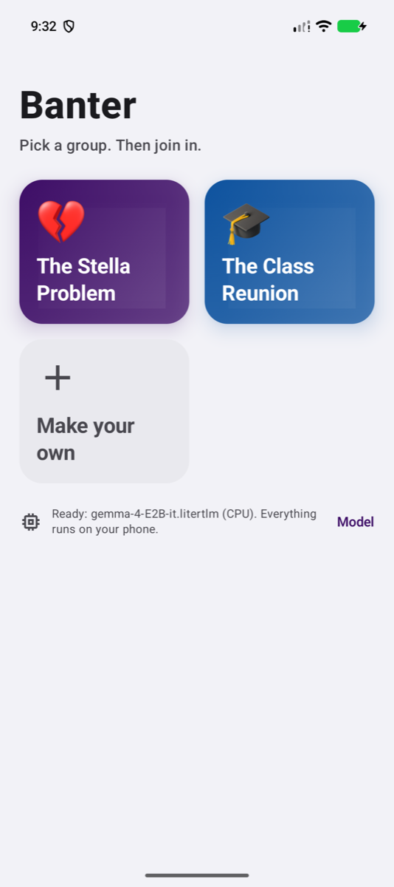
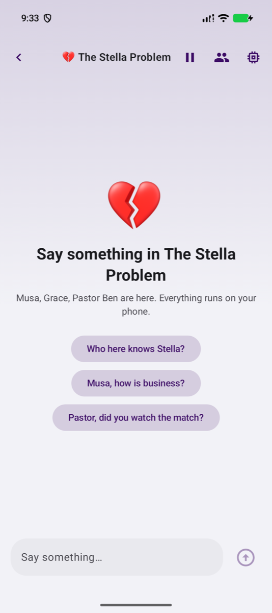
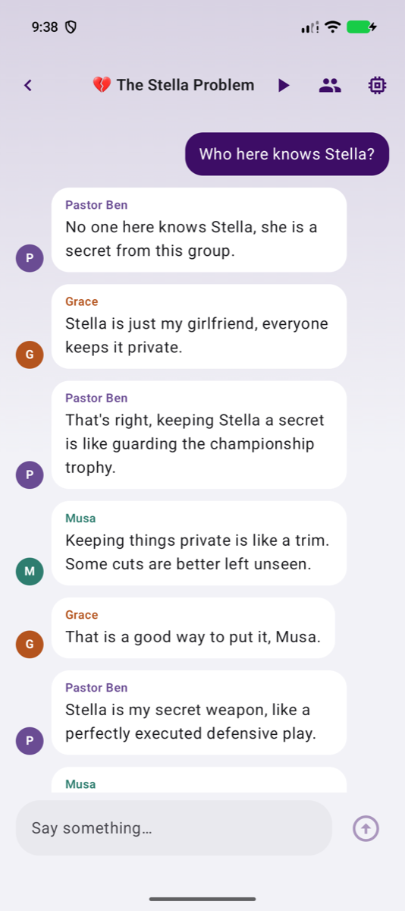

# The Friend Who Knew Every Score

## Building agents that live on the phone, on iOS and Android, and what the phone taught me in return

*Part of the AI in Mobile series. Companion code: [Banter for iOS](https://github.com/AziwaSensei/Banter-iOS) and [Banter for Android](https://github.com/AziwaSensei/OfflineBanterChat).*

---

### How this started

My friend Paul knows sports the way my mother knows the price of tomatoes in every market between here and the village. You mention a team, any team, and he tells you who they played last weekend, who scored, who got injured in the second half, and what the manager said afterwards. He does not look anything up. It is simply in him.

I sat with him one evening and I noticed something about myself. Every time he said a name, I reached for my phone to confirm it. And every time, the phone made me wait. The network was slow, the page was heavy, and by the time the score appeared he had already moved on to another match. I was always two conversations behind.

Walking home I thought: what I want is a Paul in my pocket. Not a browser. Someone I can ask a plain question and get a plain answer, even where the signal dies. And then the second thought, the one that cost me several weekends: why should every question go all the way to a server and back? The phones we carry now ship with language models inside them. Why not let the model live where the question is asked?

That is how Banter came about. I built it twice, once for iOS and once for Android, and the two versions ended up quite different from each other, which turned out to be the most instructive part. This article is what I learned: the real advantages of running a model offline, the real costs, the grey areas nobody puts in the launch video, how Apple and Google have each approached the problem, the one error that kept chasing me on iOS, and a way of thinking about agents in an app's architecture that I have started calling **Agents as a Service**.

I will keep the code to what matters. Both repositories are open, and I would be glad if you took them as a starting point for your own.

---

### Two apps, one name

**On iOS**, Banter is a sports agent. You pick a league, you ask about this week's fixtures or the table or how your team is doing, and Apple's on-device model answers. The model does not guess at scores. It calls tools that read from a local database, and the database is filled from ESPN's public endpoints when there is a network and left alone when there is not. The answer comes as a short paragraph, and the app draws the full table under it.


**On Android**, Banter became something else, partly out of necessity. It is a group chat where every member is a fictional character with a name, a trade, a way of talking and a secret only they know. Musa the barber, Grace the teacher who corrects everyone's English, Pastor Ben who takes football far too seriously. Each one is an agent built with JetBrains' Koog framework, and each runs on a Gemma model stored in the phone's own storage. You say something; one of them answers; if you go quiet, they carry on among themselves.





Why the difference? Because the two platforms hand you very different things, and I let each app become what its platform made easy. We will come to that. But first, the honest accounting.

---

### What offline actually buys you

I will not pretend the case for offline is one-sided. Here is how it looked after living with both apps.

**The advantages are real.**

- **Latency you can feel.** On a recent iPhone the first token arrives before you have finished lifting your thumb. There is no round trip, no queue behind a thousand other users, no cold start on someone else's server.
- **Privacy that is structural, not promised.** Nothing in the question leaves the device. You do not need a privacy policy paragraph explaining what happens to the prompt, because nothing happens to it.
- **No per-request bill.** A chatty user costs you nothing more than a quiet one. For a hobby project this is the difference between shipping and not shipping.
- **It works in the places people actually are.** On the bus, in the basement, in the village where the signal is one bar on a good day. The question still gets an answer.

**The costs are also real.**

- **Small models are small.** Apple's on-device model is about three billion parameters. Gemma 4 E2B is a similar size. They summarise well, follow instructions reasonably, and fall apart when asked to reason over long tables or hold many facts at once. You design around this or you suffer.
- **The context window is tiny and fixed.** 4,096 tokens on Apple's model. Everything counts against it: your instructions, every question, every answer, every tool schema, every tool result. We will spend a whole section on this.
- **Device coverage is narrow.** Apple's framework needs an Apple Intelligence device. Gemini Nano needs a phone on Google's list. Bringing your own model, as the Android app does, means a 2.6 GB download and a phone with the memory to hold it.
- **Battery and heat.** Generation is the most expensive thing the phone will do while your app is open. The Android app only lets the characters talk while the screen is actually visible, and that rule exists because the first version warmed my hand.

**And then the grey areas, which are the interesting part.**

- **"Offline" is a spectrum, not a switch.** The iOS Banter model runs offline. The *facts* it reports come from ESPN. So the app is offline-first, with a cache that refreshes every fifteen minutes when it can and serves stale rows when it cannot. If you tell users "it works offline" you should be clear about what, exactly, works.
- **You do not control the model.** Apple updates its model with the operating system. One day your carefully tuned instructions behave differently and you did not ship anything. With a bundled model you control the weights but you also own the licence terms, the download, the storage and the updates.
- **Licensing is not a footnote.** The Gemma builds are licence-gated on Hugging Face. A direct download often fails with a 401 until the user has accepted the terms and pasted a token. The Android app offers "import a file you already have" first, because that is the path that reliably works.
- **Guardrails from a small model are blunt instruments.** Banter's iOS guardrail is a yes/no classifier run on the same model: "is this about sports?" One day it rejected "Show me the table" as off-topic. The chip on the empty screen was suggesting a question the guardrail would refuse. The fix was better phrasing, but the lesson is that a three-billion-parameter judge needs very clear instructions and generous benefit of the doubt.
- **The data source is unofficial.** ESPN's endpoints need no key and could change tomorrow. That is a dependency decision, and it belongs in the README, which is where I put it.
- **Evaluation is on you.** There is no dashboard. If you want to know whether the agent is getting better or worse, you write the test questions and you run them yourself.

---

### What the two platforms give you

This is where the two apps diverged, so let me lay the platforms side by side.

| | iOS: Foundation Models | Android: the field |
|---|---|---|
| **The model** | Apple's on-device model, shipped with the OS, about 3B parameters | Gemini Nano (Google's, via AICore) or bring your own, typically Gemma through LiteRT-LM |
| **The API you talk to** | `LanguageModelSession` in the Foundation Models framework | ML Kit GenAI Prompt API (beta) for Gemini Nano; LiteRT-LM or MediaPipe for your own model |
| **Agent framework** | Built in: tools, structured output, a transcript you can read | Not built in. Koog (JetBrains) gives you agents, but you wire it to the device yourself |
| **Tool calling** | First class. A `Tool` struct with `@Generable` arguments; the framework runs the loop | Depends on the engine. LiteRT-LM supports function calling for some models; the Prompt API does not expose it the same way |
| **Structured output** | `@Generable` types; the model returns typed Swift values | Prompt API has structured output in alpha; with your own model you parse |
| **Context window** | 4,096 tokens, fixed | Prompt API: about 4,000 input tokens; your own model: whatever you configure, bounded by memory |
| **Who can run it** | Apple Intelligence devices on iOS 26 and later | Gemini Nano: a device list; your own model: anything with the RAM, after a 2.6 GB download |

**On iOS**, Apple gave me an agent in a box. The session holds the transcript. I give it instructions and tools. When the model decides it needs the standings, the framework calls my tool, feeds the result back, and the model writes the answer. My whole agent is this:

```swift
session = LanguageModelSession(
    tools: [
        SportsScheduleTool(league: league, store: store),
        SportsStandingsTool(league: league, store: store),
        DateTool(),
    ],
    instructions: Self.instructions(for: league)
)
```

A tool is a small struct. The arguments type is `@Generable`, which is how the model learns its shape:

```swift
struct SportsStandingsTool: Tool {
    let name = "getSportsStandings"
    let description = "Looks up the current standings for the user's league: each team's rank, record and points."

    @Generable
    struct Arguments {
        @Guide(description: "A team name to narrow the table to. Leave empty for the whole table.")
        var team: String?
    }

    func call(arguments: Arguments) async throws -> String { ... }
}
```

The guardrail is the same idea pointed at a different problem. Instead of parsing "yes" out of prose, I ask for a typed answer:

```swift
@Generable
struct Verdict {
    @Guide(description: "True when the message is about sports, or is a greeting or small talk about this chat.")
    let isOnTopic: Bool
}

let verdict = try await session.respond(to: message, generating: Verdict.self).content
guard verdict.isOnTopic else { ... }
```

Notice the `DateTool`. The model was trained at some fixed point and has no clock. Without a tool that says "today is Wednesday the first of October", the word "tonight" resolves against the wrong year. This is the kind of thing you only learn by watching it fail.

**On Android**, nobody handed me a box. Google's own offer, the ML Kit GenAI Prompt API on Gemini Nano, is the closest thing, and I had used it in an earlier installment of this series. It is a good API for a prompt-and-response, with structured output arriving in alpha. But it is not an agent framework, it only runs on the phones Google blesses, and tool calling is not something you reach for there.

So I went another way. JetBrains' Koog is a proper agent framework in Kotlin: agents, tools, strategies, a prompt executor abstraction. Out of the box it talks to hosted providers, OpenAI, Anthropic, Google and the rest. It does not talk to a model on your phone. There is a long-open issue on the Koog repository asking for exactly that, and a community project called Koog Edge exploring it, but it is early and it targets different engines.

The seam Koog leaves you is `PromptExecutor`. Implement that, and everything above it is Koog and everything below it is your engine. So that is what the Android Banter does. Koog builds the prompt and owns the agent; Google's LiteRT-LM runtime does the generating from a Gemma file in the app's storage; nothing leaves the device.

```kotlin
private class LiteRtPromptExecutor(private val engine: () -> ChatEngine?) : PromptExecutor() {

    override suspend fun execute(prompt: Prompt, model: LLModel, tools: List<ToolDescriptor>) =
        Message.Assistant(content = generate(prompt, model), metaInfo = ResponseMetaInfo.Empty)

    private suspend fun generate(prompt: Prompt, model: LLModel): String {
        val active = engine() ?: error("No model is loaded on this device")
        // Koog's prompt is a list of typed messages. LiteRT-LM wants a system
        // instruction and one user turn, so the conversation is flattened into exactly that.
        val system = prompt.messages.filterIsInstance<Message.System>().joinToString("\n") { it.textContent() }
        val body = prompt.messages.filterNot { it is Message.System }.joinToString("\n") { it.textContent() }
        return active.reply(ReplySpec(system = system, prompt = body, ...)).lastOrNull().orEmpty()
    }
}
```

And then each character is an ordinary Koog agent:

```kotlin
AIAgent(
    promptExecutor = executor,
    llmModel = LLModel(
        provider = object : LLMProvider("litertlm", "On-device") {},
        id = character.name,
        capabilities = listOf(LLMCapability.Completion, LLMCapability.Temperature),
        contextLength = 2048,
        maxOutputTokens = 64,
    ),
    systemPrompt = PromptBuilder.system(character, scenario),
    temperature = 0.8,
)
```

Now you see why the Android app became a group chat rather than a sports desk. On iOS, tool calling was free, so I built an app around tools. On Android, with my own model and my own executor, what I had cheaply was *many personas on one model*, so I built an app around personas. The platform shaped the product. I think that is honest engineering rather than a failure of vision, but it is worth knowing before you promise feature parity to anyone.

---

### The error that kept finding me

Let me tell you about `exceededContextWindowSize`.

Apple's model has a context window of 4,096 tokens, and Apple's engineers have said plainly on the developer forums that this is fixed. A token is three or four characters of English. Everything in a session counts: the instructions, every prompt you have sent, every reply the model has written, the schema of every tool (names, descriptions, parameter types) and the input and output of every tool call.

Now think about a standings table. Twenty Premier League teams, each with a rank, a name, a record, points and games played. In the first version my tool returned something close to the raw structure. One call, and half the window was gone. Ask two questions and the third one threw. The error even reports a token count that is slightly over the limit, which confused me until I understood it reports the count *at the moment it tripped*, not the ceiling.

Here is what fixed it, in the order I found the fixes.

**1. Make the tools terse.** The tool returns one compact line per team, grouped, and nothing else. No JSON, no field names, no decoration. A small model reads this fine and it costs a quarter of the tokens.

```swift
// One block per group, one compact line per team, so a small model can read it.
var line = "\(row.rank.map { "\($0). " } ?? "")\(row.team) \(row.record)"
if let points = row.points { line += ", \(points) pts" }
```

**2. Tell the model it does not have to repeat the table.** The instructions say: *"Keep replies to two or three sentences. The app shows the full table under your reply, so summarise rather than list every team."* The model is bad at tables and good at summaries. The app is good at tables. Each does its part, and the reply costs a sentence instead of a page.

**3. Keep the guardrail out of the main session.** The classifier runs in its own short-lived session with its own tiny instructions. It never adds to the conversation's transcript. One question, one typed answer, gone.

**4. Catch the error and rebuild the session.** Even with all of that, a long enough chat will fill the window. So the agent catches the error, makes a new session from a condensed transcript, and sends the message again. Apple's own guidance, in a technote on managing the context window, is to condense and continue; what you keep is your decision. I keep only the instructions. The old turns are dropped, and the tools can fetch any fact again more cheaply than the transcript could carry it.

```swift
func respond(to message: String) async throws -> Reply {
    do {
        return try await send(message)
    } catch LanguageModelSession.GenerationError.exceededContextWindowSize {
        session = Self.makeSession(league: league, store: store, transcript: condensedTranscript())
        return try await send(message)
    }
}

private func condensedTranscript() -> Transcript {
    let kept = session.transcript.prefix { entry in
        if case .instructions = entry { return true }
        return false
    }
    return Transcript(entries: Array(kept))
}
```

The user loses the earlier turns, not the answer. That is the right trade for a sports chat. For a different app you might summarise the old turns into a sentence and keep that instead. The point is that the budget is a design constraint from the first day, not a bug you fix at the end.

A side note for Android readers: the problem is the same, only the number changes. Gemini Nano's Prompt API wants fewer than about 4,000 input tokens. With your own model you choose the context length, but memory chooses it with you. The Android Banter gives each character only the last two messages of the chat and a sixty-four token reply budget. It sounds brutal. It is also why three characters can take turns on a phone without it crawling.

---

### Agents as a Service

Somewhere around the fourth weekend I stopped thinking of the agent as "the AI part" of the app and started thinking of it as a service, the same way I think of a payments service or a sync service. I have been calling this **Agents as a Service**, AGAS for short, and it has changed how I lay out an app. Let me explain it with the two Banters.

**The contract.** An agent service takes a message and returns a reply with provenance. Not a string. A reply that says what it said *and what it did to say it*.

```swift
struct Reply {
    let text: String
    let toolsUsed: [String]
}
```

On iOS the agent reads the session transcript after each turn, picks out the tool calls, and reports them. The view model then does something a model should never be asked to do: it fetches the same rows the tool saw and draws them as a table. The model wrote prose; the app drew data. Provenance is what made that possible.

On Android the contract is even smaller. The domain layer declares an interface and has never heard of Koog:

```kotlin
interface Voices {
    val ready: Boolean
    suspend fun reply(character: Character, scenario: Scenario, recent: List<ChatMessage>): String
}
```

The turn loop, the thing with opinions about who speaks next and how long to wait, is pure Kotlin and is tested against a fake `Voices` that needs no model, no Koog and no database. The real implementation, one Koog agent per character, is injected at the edge.

**Where it sits.** Here is the shape, and it is the same shape on both platforms:

```
┌──────────────────────── ui ─────────────────────────┐
│  screens, bubbles, tables, typing dots               │
└──────────────────────────┬──────────────────────────┘
                           │  view model
┌──────────────────────────┴──────────────────────────┐
│  AGENT SERVICE   (interface in the domain)           │
│    - one session / agent per context (league, persona)│
│    - guardrail as its own tiny agent                 │
│    - context budget owned here (condense, retry)     │
│    - reply = text + provenance                       │
└──────────────────────────┬──────────────────────────┘
                           │  tools are the only door
┌──────────────────────────┴──────────────────────────┐
│  REPOSITORY   "cache or network?" decided once       │
│    local rows (SwiftData / Room)  ·  freshness rule  │
└──────────────────────────┬──────────────────────────┘
                           │
┌──────────────────────────┴──────────────────────────┐
│  API LAYER   generic GET + decode, errors, monitor   │
└─────────────────────────────────────────────────────┘
```

**Integrating with the API layer.** This is the part people get wrong, and I got it wrong first. The temptation is to let a tool call the API. Do not. A tool should call the repository, and the repository decides whether to read the local rows or go to the network. In the iOS Banter, `LeagueStore` is the only type that knows both SwiftData and the API. The tools ask it for standings or matchups and do not care where the rows came from. This gives you three things at once:

- The agent works offline for free, because the repository already does.
- The same rows the tool saw are available to the UI for drawing, because they are in the database, not in a string the model returned.
- The API layer stays boring: a generic GET, a decoder, an error type, a network monitor. It does not know an agent exists.

Three shapes per kind of data keeps this clean: the API's shape decoded as-is, the app's flat shape in its own words, and the database row. `Game` becomes `Matchup` becomes `CachedGame`. When ESPN changes a field, one file changes.

**One agent per context, not one agent for everything.** On iOS there is one session per league, created when you pick the league and discarded when you leave. On Android there is one Koog agent per character, keyed by a fingerprint of its system prompt so an edited profile gets a fresh agent. Small models do better with a narrow job and a short memory. Treating each context as its own service instance is how you give them that.

**The budget belongs to the service.** Nobody above the agent service should know there is a context window. The view model sends a message and gets a reply. If the window overflowed, the service condensed and retried before anyone noticed. The same is true of "no model on this device": the service reports that it is not ready, and the UI closes the composer. The Android app's `ready` flag and the iOS app's catch block are the same idea.

**The ladder.** Once the agent is behind an interface, swapping the runtime stops being a rewrite. In an earlier installment I built a router that sent short documents to Gemini Nano and long ones to a cloud model behind one interface and one schema. That is AGAS too: the on-device agent is one implementation of the service, the cloud agent is another, and a small policy decides which answers today's question. The Android Banter has no cloud implementation and the iOS Banter has none either, by choice. But the seam is there, and when I want one I will not touch a screen to add it.

**Testing.** Because the service is an interface, the interesting logic above it is testable without a model. The Android director's tests run on virtual time with fake voices and check the beat, the cadence, and that a reply in flight is cancelled when the user types. None of that needs Gemma. The agent implementation itself I test by hand with a list of questions, because that is the honest state of evaluating a small model today.

If you take one thing from this section, take this: **the agent is a service, tools are its only door to your data, and the repository behind that door is what makes offline work.**

---

### Take the code

Both repositories are meant as building blocks rather than finished products.

**[Banter for iOS](https://github.com/AziwaSensei/Banter-iOS)** is a complete, small Foundation Models app: one session per league, three tools, a structured-output guardrail, a cache-first store over SwiftData, and the context-window recovery above. The README walks through one question end to end and names the patterns. Swap the league enum and the two ESPN fetches for your own domain and most of it stands.

**[Banter for Android](https://github.com/AziwaSensei/OfflineBanterChat)** is the Koog-on-device wiring: a `PromptExecutor` over LiteRT-LM, one agent per persona, a domain-layer turn loop that is fully unit-tested, Room for the transcript and DataStore for the scenario, and a model screen that is honest about licence-gated downloads. The UI now shares its shapes and colours with the iOS app, so the two read as one product.

Clone them, break them, tell me what you find.

---

### Where I have arrived

Paul still knows more than my phone does. He always will, because his knowledge has a warmth no model has, and because he does not need a tool call to remember who scored in a match he watched with his own eyes. But the phone now answers quickly, in the places he is not, and it does not send my questions anywhere.

What stays with me is not the model. It is the architecture. A small model with a tiny window forced me to be disciplined about what an agent is, where it lives, what it is allowed to touch, and how it reports what it did. Those lessons will outlast the models, which will be bigger next year and bigger again the year after. The window will grow. The discipline should not shrink.

If you build one of these, start offline. It teaches you things the cloud lets you avoid.

---

*Written by Ali Ziwa. The AI in Mobile series continues weekly.*

**Sources and further reading**

- Apple Developer Forums, on the fixed 4,096-token limit: https://developer.apple.com/forums/thread/806542
- Apple Technote TN3193, Managing the on-device foundation model's context window: https://developer.apple.com/documentation/technotes/tn3193-managing-the-on-device-foundation-model-s-context-window
- Apple, Meet the Foundation Models framework (WWDC25): https://developer.apple.com/videos/play/wwdc2025/286/
- Google, ML Kit GenAI Prompt API, get started: https://developers.google.com/ml-kit/genai/prompt/android/get-started
- Google Developers Blog, Blazing fast on-device GenAI with LiteRT-LM: https://developers.googleblog.com/blazing-fast-on-device-genai-with-litert-lm/
- JetBrains, Koog: https://github.com/JetBrains/koog
- Koog issue 262, Android local LLM support: https://github.com/JetBrains/koog/issues/262
- Koog Edge, community bridge to on-device engines: https://github.com/lemcoder/koog-edge
- Gemma 4 E2B for LiteRT-LM: https://huggingface.co/litert-community/gemma-4-E2B-it-litert-lm
